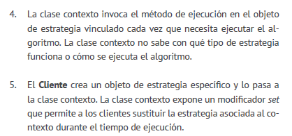

1. La clase Cliente contiene la lógica de negocio existente del
   programa.
2. La Interfaz con el Cliente describe un protocolo que otras clases
   deben seguir para poder colaborar con el código cliente.
3. Servicio es alguna clase útil (normalmente de una tercera
   parte o heredada). El cliente no puede utilizar directamente
   esta clase porque tiene una interfaz incompatible.
4. La clase Adaptadora es capaz de trabajar tanto con la clase
   cliente como con la clase de servicio: implementa la interfaz
   con el cliente, mientras envuelve el objeto de la clase de servicio.
   La clase adaptadora recibe llamadas del cliente a través
   de la interfaz adaptadora y las traduce en llamadas al objeto
   envuelto de la clase de servicio, pero en un formato que pueda
   comprender.
5. El código cliente no se acopla a la clase adaptadora concreta siempre y cuando funcione con la clase adaptadora a través
      de la interfaz con el cliente. Gracias a esto, puedes introducir
      nuevos tipos de adaptadores en el programa sin descomponer
      el código cliente existente. Esto puede resultar útil cuando la
      interfaz de la clase de servicio se cambia o sustituye, ya que
      puedes crear una nueva clase adaptadora sin cambiar el código
      cliente.

### Aplicabilidad
* Utiliza la clase adaptadora cuando quieras usar una clase existente,
pero cuya interfaz no sea compatible con el resto del
código.
* El patrón Adapter te permite crear una clase intermedia que
  sirva como traductora entre tu código y una clase heredada,
  una clase de un tercero o cualquier otra clase con una interfaz
  extraña.
* Utiliza el patrón cuando quieras reutilizar varias subclases existentes
  que carezcan de alguna funcionalidad común que no
  pueda añadirse a la superclase.
* Puedes extender cada subclase y colocar la funcionalidad que
  falta, dentro de las nuevas clases hijas. No obstante, deberás
  duplicar el código en todas estas nuevas clases, lo cual huele
  muy mal.