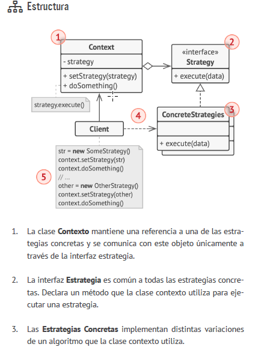

1. La clase Contexto almacena una referencia a uno de los objetos
   de estado concreto y le delega todo el trabajo específico
   del estado. El contexto se comunica con el objeto de estado a
   través de la interfaz de estado. El contexto expone un modificador
   (setter) para pasarle un nuevo objeto de estado.
2. La interfaz Estado declara los métodos específicos del estado.
   Estos métodos deben tener sentido para todos los estados concretos,
   porque no querrás que uno de tus estados tenga métodos
   inútiles que nunca son invocados.
3. Los Estados Concretos proporcionan sus propias implementaciones
   para los métodos específicos del estado. Para evitar la
   duplicación de código similar a través de varios estados, puedes
   incluir clases abstractas intermedias que encapsulen algún
   comportamiento común.
   Los objetos de estado pueden almacenar una referencia inversa
   al objeto de contexto. A través de esta referencia, el estado
   puede extraer cualquier información requerida del objeto de
   contexto, así como iniciar transiciones de estado.
4. Tanto el estado de contexto como el concreto pueden establecer
   el nuevo estado del contexto y realizar la transición de
   estado sustituyendo el objeto de estado vinculado al contexto.

### Aplicabilidad 

*   Utiliza el patrón State cuando tengas un objeto que se comporta
de forma diferente dependiendo de su estado actual, el número
de estados sea enorme y el código específico del estado
cambie con frecuencia.

* El patrón sugiere que extraigas todo el código específico del
  estado y lo metas dentro de un grupo de clases específicas.
  Como resultado, puedes añadir nuevos estados o cambiar los
  existentes independientemente entre sí, reduciendo el costo
  de mantenimiento.
* Utiliza el patrón cuando tengas una clase contaminada con
  enormes condicionales que alteran el modo en que se comporta
  la clase de acuerdo con los valores actuales de los campos
  de la clase.
* El patrón State te permite extraer ramas de esos condicionales
  a métodos de las clases estado correspondientes. Al hacerlo,
  también puedes limpiar campos temporales y métodos de
  ayuda implicados en código específico del estado de fuera de
  tu clase principal.
* Utiliza el patrón State cuando tengas mucho código duplicado
  por estados similares y transiciones de una máquina de estados
  basada en condiciones.
* El patrón State te permite componer jerarquías de clases de
  estado y reducir la duplicación, extrayendo el código común y
  metiéndolo en clases abstractas base.