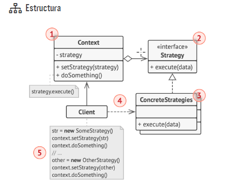

1. La clase Contexto mantiene una referencia a una de las estrategias
   concretas y se comunica con este objeto únicamente a
   través de la interfaz estrategia.

2. La interfaz Estrategia es común a todas las estrategias concretas.
   Declara un método que la clase contexto utiliza para ejecutar
   una estrategia.

3. Las Estrategias Concretas implementan distintas variaciones
   de un algoritmo que la clase contexto utiliza.

4. La clase contexto invoca el método de ejecución en el objeto
   de estrategia vinculado cada vez que necesita ejecutar el algoritmo.
   La clase contexto no sabe con qué tipo de estrategia
   funciona o cómo se ejecuta el algoritmo.

5. El Cliente crea un objeto de estrategia específico y lo pasa a
   la clase contexto. La clase contexto expone un modificador set
   que permite a los clientes sustituir la estrategia asociada al contexto
   durante el tiempo de ejecución.