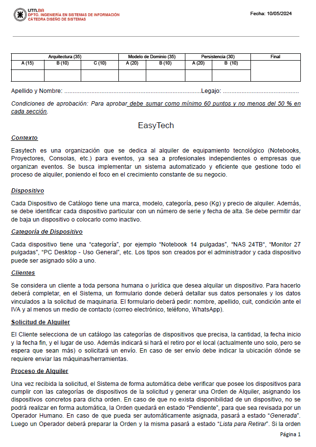
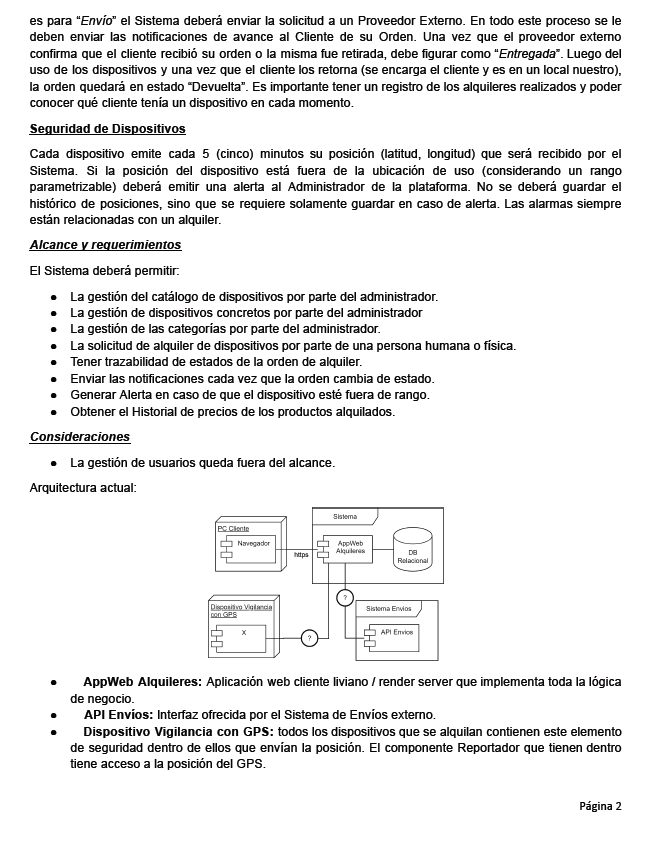
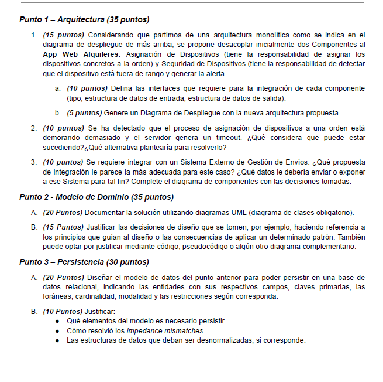

## Alcance
- La gestión del catálogo de dispositivos por parte del administrador.
- La gestión de dispositivos concretos por parte del administrador.
- La gestión de las categorías por parte del administrador.

